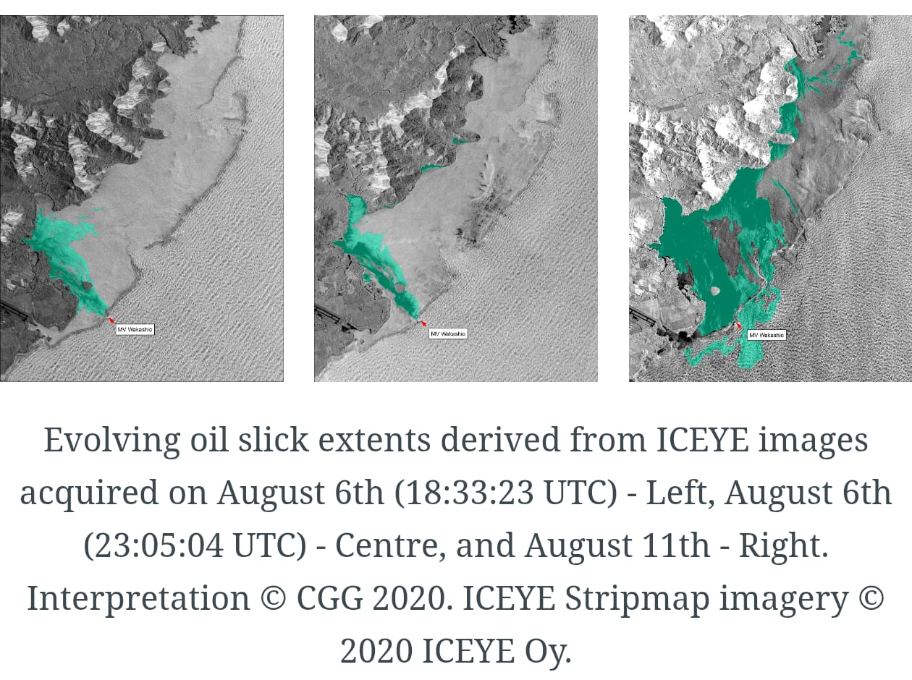
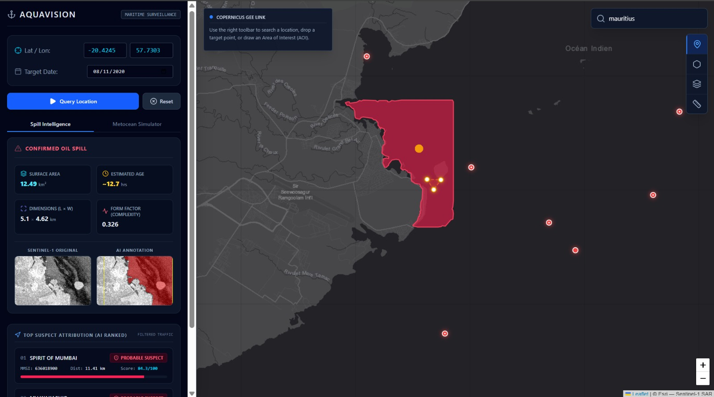

# AquaVision: Autonomous Maritime Surveillance & Oil Spill Attribution Pipeline

[](https://www.python.org/)
[](https://react.dev/)
[](https://opendrift.github.io/)
[]()

> **AquaVision** is an end-to-end operational intelligence platform designed to detect offshore oil spills from space, reconstruct their trajectory using real-world metocean physics, and scientifically attribute the spill to the responsible vessel using machine learning and historical AIS (Automatic Identification System) tracking data.

---

##  Platform Preview & Prototype
*Note: The dashboard combines spatial intelligence, fluid dynamics simulation, and multi-criteria vessel attribution into a single professional command center.*

| **SAR Spill variations** | **Prototype(Interface)** |
| :-----------------------------------: | :-------------------------------------: |
|  |  |   
| *Sentinel-1 SAR anomaly extraction and metric profiling.* | *Interface showing the highlighted oil spill region and the most likely vessel responsible for it.* |

---

## Core Architecture & 3-Stage Pipeline

AquaVision eliminates synthetic data dependencies by relying strictly on live APIs and real-world kinematic modeling across three sequential stages:

### 1. Stage 1: Satellite SAR Processing & Spill Detection
* **Data Source:** Google Earth Engine & Sentinel-1 SAR imagery.
* **Functionality:** Extracts radar backscatter anomalies to segment oil slicks from open water. Computes surface area, perimeter dimensions, form-factor complexity, and precise geographic centroids.

### 2. Stage 2: Dynamic Metocean Hindcast Simulation
* **Data Source:** Live historical weather data via the **Open-Meteo Archive API** and native **OpenDrift / OpenOil** fluid mechanics.
* **Functionality:** Dynamically queries real-world wind speeds, directions, and ocean currents for the exact incident date and location. Seeds fluid oil particles and runs a backward-in-time ($ -24\text{h} $) hindcast simulation incorporating turbulent mixing and spreading to locate the exact origin zone.

### 3. Stage 3: AIS Traffic Intelligence & Multi-Criteria Attribution
* **Data Source:** Regional historical AIS tracking records.
* **Functionality:** Ingests surrounding maritime traffic and filters out background noise using an unsupervised **Isolation Forest** model to detect behavioral anomalies (e.g., erratic course changes, unexpected stalls). Evaluates suspects using a rigorous **6-Factor Weighted Scoring Matrix**:
  * **35%** Spatial Proximity to Origin
  * **20%** Hindcast Trajectory Intersection
  * **15%** Trajectory Alignment
  * **15%** Behavioral Anomalies (Isolation Forest)
  * **10%** Temporal Proximity Window
  * **5%** Vessel Characteristics (Tanker/Cargo Risk weighting)

---

## UI
* **Top 3 Suspect Leaderboard:** Instantly filters out hundreds of irrelevant vessels to present a concise, ranked threat list categorized into strict risk tiers (**Red** for probable suspects, **Orange** for behavioral anomalies, and **Green** for cleared safe traffic).
* **MarineTraffic-Style Intelligence Popups:** Clicking any vessel node on the Leaflet map opens a detailed tactical profile displaying MMSI, vessel type, speed, course, and score breakdown.
* **Time-Stepped Simulation Slider:** Enables analysts to play back or scrub through the chronological drift of the oil slick from its origin point to the detection site.

---

## Local Installation & Quick Start

### Prerequisites
* Python 3.11+
* Node.js & npm

### 1. Backend Setup (FastAPI & OpenDrift Engine)

```bash
cd aquavision-backend

# Install Python dependencies
pip install -r requirements.txt

# Alternatively, install the core dependencies manually:
# pip install opendrift netCDF4 xarray dask pyproj matplotlib

# Launch the FastAPI server
uvicorn main:app --port 8000 --reload
```

### 2. Frontend Setup (ReactJS)

```bash
cd aquavision-frontend

# Install dependencies
npm install

# Launch the development server
npm run dev
```

### Tech Stack

**Backend:** Python, FastAPI, NumPy, Pandas, Scikit-Learn (Isolation Forest), Requests.

**Physics & Geospatial:** OpenDrift (OpenOil), PyProj, Open-Meteo Historical Archive API.

**Frontend:** React, Vite, Tailwind CSS, Leaflet / React-Leaflet, Lucide Icons.
